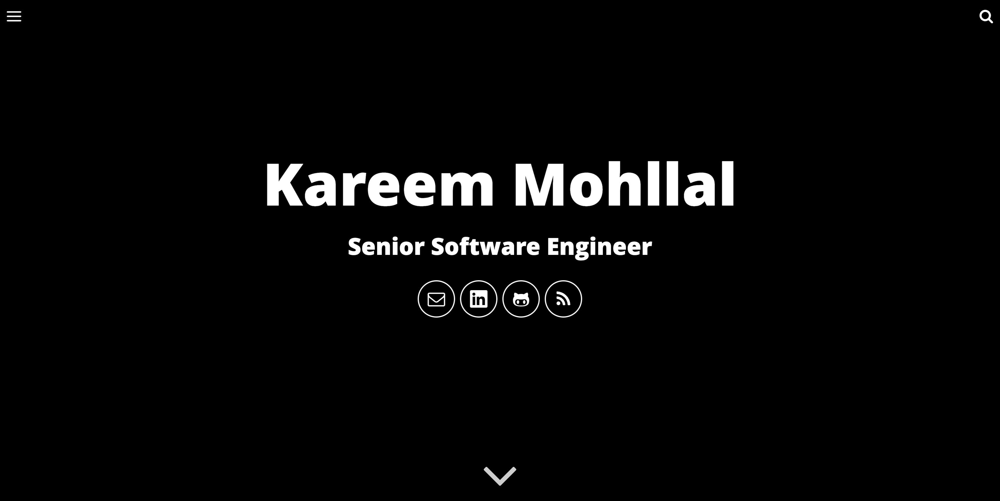

# My Personal Blog



This is my personal blog built using Jekyll and the [Will Jekyll Template](https://github.com/willianjusten/will-jekyll-templat).

## Requirements

- Node.js v11.9.0
- Ruby 3.2.2

The `preview-resizer` Gulp task that resized blogs' preview images to 1200 x 630 pixels to ensure that the image displays well. This task requires `imagemagick` and `GraphicsMagick` to be installed on your system. You can install it using the following command:

MacOS (using Homebrew):

```shell
brew install imagemagick
brew install graphicsmagick
```

Ubuntu:

```shell
sudo apt-get install imagemagick
sudo apt-get install graphicsmagick
```

## Setup

### Basic Setup

1. [Install Jekyll](http://jekyllrb.com)
2. Clone the repo.
3. Edit `_config.yml` to personalize your site.
4. Check out the posts in `_posts` for examples on categories, tags, and other YAML data.
5. Edit [this line in the search component](https://github.com/mohllal/mohllal.github.io/blob/main/src/js/simpleJekyllSearch.js#L4) to point to your own URL.
6. Read the documentation below for further customization pointers.
7. **Remember to compile your assets files using Gulp!**

### Site and User Settings

Customize your site by editing `_config.yml`.

```yml
# Site settings
title: Kareem Mohllal's Blog
description: A journey through systems, architectures, and all things software engineering.
baseurl: ""
url: "http://localhost:3000" # the base hostname & protocol for your site

# Personal information
me:
  name: Kareem Mohllal
  tagline: Writing stories about the world for the machine; sometimes it understands.
  title: Senior Software Engineer
  email: kareem.mohllal@gmail.com
  github: mohllal
  linkedin: mohllal
  picture: /assets/images/me.jpg
```

**Don't forget to change your baseurl before build your site!**

### Color customization

All color variables are in `src/styl/variable`. To change the main color, just set the new value at `main` assignment.

Other colors are for texts and the code background color.

### Creating posts

You can use the `init_post.sh` to create your new posts. Just follow the command:

```shell
./init_post.sh -c Post Title
```

The new file will be created at `_posts` with this format `date-title.md`.

### Front-matter

When you create a new post, you need to fill the post information in the front-matter, follow this example:

```markdown
---
layout: post
title: "How to use"
date: 2015-08-03 03:32:44
description: 'First steps to use this template'
image: '/assets/img/post-image.png'
tags:
- jekyll
- template
categories:
- I love Jekyll
excerpt: 'How to install and use this template'
---
```

### Running Locally

In order to compile the assets and run Jekyll locally you need to follow those steps:

- Install [NodeJS](https://nodejs.org/)
- Install [Ruby](https://www.ruby-lang.org/en/downloads/)
- Run `npm install`
- Run `bundle install`
- Run `gulp`

## License

This theme is free and open source software, distributed under the The MIT License. So feel free to use this Jekyll theme on your site without linking back to me or using a disclaimer.
